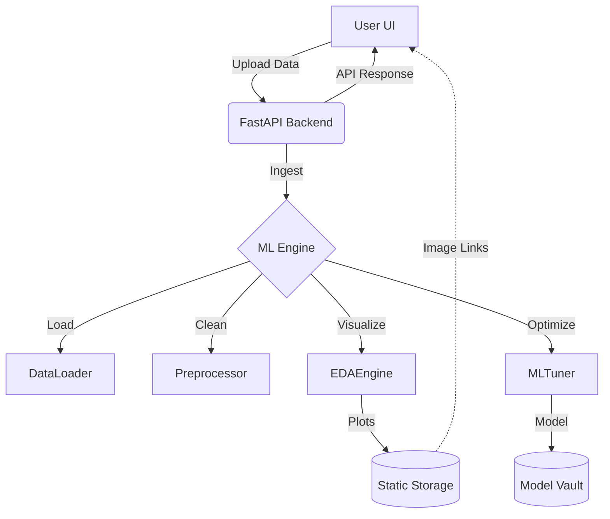

# MLSuite: Comprehensive Interview & Architecture Guide

This document serves as a master reference for the **MLSuite** project, designed to aid in technical interviews and architectural deep-dives. It covers the system's modular design, implementation layers, and common technical questions.

---

## 1. Project Overview
**MLSuite** is a full-stack, automated Machine Learning pipeline. It simplifies the end-to-end ML lifecycle—from data ingestion and cleaning to automated hyperparameter tuning and visual reporting—all wrapped in a premium "Digital Nebula" design aesthetic.

### Core Value Proposition
- **Automation**: Eliminates manual data cleaning and algorithm selection.
- **Scalability**: Decoupled ML Engine and API layers.
- **User Experience**: High-fidelity dashboard for real-time intelligence discovery.

---

## 2. Implementation Layers

### A. Data Ingestion Layer (`ML/data_loader.py`)
- **Purpose**: A unified entry point for diverse data formats.
- **Implementation**: Uses a `DataLoader` class with static methods for CSV, Excel, SQLite, and MongoDB. 
- **Key Logic**: It abstracts the complexity of connection URIs and table schemas, returning a standard `pandas.DataFrame` for downstream processing.

### B. Automated Preprocessing Layer (`ML/preprocessor.py`)
- **Purpose**: Standardizing raw data for mathematical models.
- **Implementation**:
    - **Imputation**: Numeric missing values use `mean` strategy; categorical use `most_frequent`.
    - **Encoding**: Uses `LabelEncoder` for categorical strings.
    - **Scaling**: Uses `StandardScaler` to ensure feature parity (zero mean, unit variance).
- **Automation**: The `process_all()` method chains these steps, making the pipeline "no-code" for the end-user.

### C. Discovery (EDA) Layer (`ML/eda_engine.py`)
- **Purpose**: Generating statistical insights before modeling.
- **Implementation**: Wraps Matplotlib and Seaborn.
- **Aesthetic Integration**: Explicitly configures Seaborn themes to match the "Digital Nebula" CSS variables (dark backgrounds, glowing primary accents).
- **Freshness Policy**: Includes a `clear_plots()` method to ensure that each "run" provides a clean, relevant report without stale artifacts.

### D. Intelligence (ML & Tuning) Layer (`ML/tuner.py`)
- **Purpose**: Finding the optimal model for a specific target.
- **Implementation**: 
    - **Competitive Benchmarking**: Runs multiple algorithms (SVC, Random Forest, etc.) in parallel.
    - **Optimization**: Uses `GridSearchCV` for hyperparameter searching.
    - **Leaderboard**: Generates a ranking of models based on Accuracy (Classification) or R2/MSE (Regression).

### E. API Orchestration Layer (`backend/main.py`)
- **Purpose**: The "Controller" of the system.
- **Implementation**: FastAPI based REST API.
- **Features**: JWT-based Authentication, static file serving for ML plots, and model persistence using `joblib`.

### F. Presentation Layer (`frontend/src/`)
- **Purpose**: User Interaction and State Management.
- **Implementation**: React (Vite) + TypeScript.
- **Design System**: Tailwind CSS v4 implementation of the "Digital Nebula" aesthetic (Glassmorphism + No-Line hierarchy).

---

## 3. File-by-File Breakdown

| File Path | Role | Key Contribution |
| :--- | :--- | :--- |
| `ML/data_loader.py` | Connector | Handles SQL/NoSQL/File I/O logic. |
| `ML/preprocessor.py` | Cleaner | Automates data imputation and scaling. |
| `ML/eda_engine.py` | Visualizer | Generates histograms and correlation heatmaps. |
| `ML/tuner.py` | Optimizer | Orchestrates GridSearchCV benchmarks. |
| `backend/main.py` | Orchestrator | Defines endpoints (`/train`, `/analyze`, `/upload`). |
| `backend/auth.py` | Security | Manages JWT tokens and password hashing. |
| `frontend/src/pages/Dashboard.tsx` | View | Manages the 4-phase ML lifecycle state machine. |
| `docker-compose.yml` | Infrastructure | Containerizes the entire stack for portability. |

---

## 4. Key Interview Questions & Answers

### Q1: Why did you choose FastAPI over Flask or Django for this project?
**Answer**: FastAPI is asynchronous by nature, which is excellent for handling long-running ML tasks (like training or EDA) without blocking the server. It also provides automatic Swagger/OpenAPI documentation and type-safety through Pydantic, making the interface between the Python ML engine and the TypeScript frontend much more robust.

### Q2: How do you handle the "Report Freshness Policy" implementation?
**Answer**: In the `EDAEngine`, I implemented a `clear_plots()` method that uses `shutil.rmtree` on the static directory at the start of every analysis run. This prevents "stale" data visualization where a user might see plots from a previous session or a different dataset.

### Q3: Explain the Automated Preprocessing logic. How do you handle non-numeric data?
**Answer**: The `Preprocessor` uses `select_dtypes` to separate numerical and categorical columns. Categorical data is handled by a `SimpleImputer` with a `most_frequent` strategy to fill gaps, followed by a `LabelEncoder` to convert strings into integers which ML models can interpret.

### Q4: How does the system decide which model is the "Winner"?
**Answer**: The `MLTuner` performs a benchmarking run. It trains several base models, performs a Grid Search for each, and calculates a scoring metric (Accuracy for classification, R2 for regression). It then sorts a `leaderboard` and returns the model with the highest score as the recommended "Winner".

### Q5: Describe the "Container Project" structure. Why is Docker used here?
**Answer**: The project is containerized using `Docker` and `Docker Compose` to ensure "write once, run anywhere" portability. This solves the "it works on my machine" problem—especially common in ML due to complex library dependencies like `scikit-learn` or `matplotlib`. It encapsulates the Python environment and the Node.js build process into isolated services.

---

## 5. Architectural Diagram (Logical Flow)

---
*Prepared for MLSuite Deployment Strategy & Interview Readiness.*
